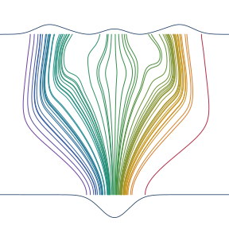

<p align="center">
  <picture>
    <source media="(prefers-color-scheme: dark)"
            srcset="assets/logos/logo-dark-transparent.svg">
    
  </picture>
</p>

# Bohmian Flow for Quantum Dynamics

[](https://github.com/wangleiphy/BohmianFlow/actions/workflows/tests.yml)

The time-dependent Schrödinger equation is solved by training a neural
network to represent the score `s = ∇ ln ρ` of the evolving probability
density, with particles propagated along Bohmian trajectories whose
acceleration is determined self-consistently by that score.  The full
loss is a single Fisher divergence integrated over the time horizon,
minimised by backpropagation through the trajectory ODE.

This repository contains the minimal code needed to reproduce every
figure of the paper and nothing else.  **A trained checkpoint and the
FFT reference data are bundled so the main results can be regenerated
without retraining.**

## Repository layout

```
bohmian_flow/   Library
  potentials.py             Morse chain, double-well factories
  baseline.py               Gaussian baseline from harmonic approximation
  network.py                Score network (MLP + FiLM time conditioning)
  trajectory.py             Leapfrog + F/G co-integration
  core.py                   Fisher divergence loss
  train.py                  Training loop (Adam + pmap + plateau LR)
  evaluate.py               Inference-time moment collection
  fft.py                    Split-operator FFT reference solver
  checkpoint.py             Pickle save/load

scripts/                  End-user CLIs
  train_morse.py            Train the d=4 Morse chain
  compute_fft_reference.py  Produce FFT moments + psi snapshots
  extract_training_log.py   Parse training log into NPZ
  fig1_doublewell.py        Figure 1 (double-well schematic)
  fig3_training.py          Figure 3 (loss + energy error vs epoch)
  fig4_moments.py           Figure 4 (per-mode <x_i>(t), sigma_i(t))
  fig5_score_field.py       Figure 5 (learned score-field streamlines)

tests/                    pytest unit + smoke tests (28 tests)

checkpoints/
  morse_d4.pkl              Trained 45 000-epoch d=4 Morse chain
                            (drives Figs 3-5).

data/
  fft_ref_morse_d4.npz      FFT reference: t, means (315, 4), sigmas,
                            E_exact = 2.3236172282...
  fig4_moments.npz          Cached learned vs exact moments (Figure 4).
  fig5_score_data.npz       Cached learned score field + slice densities
                            (Figure 5).
```

## Requirements

Python 3.10+ with

```
jax>=0.4.25  jaxlib>=0.4.25  optax>=0.2.0
numpy>=1.26  scipy>=1.11     matplotlib>=3.8  pytest>=7.4
```

Install with

```bash
python -m venv .venv && source .venv/bin/activate
pip install -r requirements.txt
```

JAX picks up any visible GPUs automatically.  The training loop uses
`jax.pmap` for data-parallelism whenever `jax.device_count() > 1`;
single-GPU and CPU runs work without any change.

## Tests

```bash
pytest -v
```

Expected: `28 passed` in under a minute on CPU.

## Reproducing the paper figures

There are three reproduction tiers, in decreasing order of turnaround:

1. **Replot only** — loads the shipped NPZ caches and re-emits the PNG.
2. **Inference** — uses the shipped checkpoint + FFT reference to
   regenerate the moments / score-field NPZ, then plot.
3. **Full training** — retrains the score network from scratch.

All three work from the repository root.

### Figure 1 — Double-well schematic

Exact FFT density + exact Bohmian trajectories on a 1D symmetric quartic.
No training is involved.  Runs on CPU in ≤1 min.

```bash
python scripts/fig1_doublewell.py \
    --data-out data/fig1_doublewell.npz \
    --output   figures/fig1_doublewell.png
```

Replot from cache:

```bash
python scripts/fig1_doublewell.py \
    --data   data/fig1_doublewell.npz \
    --output figures/fig1_doublewell.png
```

### Figure 3 — Training convergence (d=4 Morse chain)

Panel (a) Fisher loss vs epoch; panel (b) |⟨E⟩ − E_exact| vs epoch.
Requires a training log.  Because the log is ~45 000 lines (≥ 10 MB), it
is not shipped.  To regenerate: produce the log by (re)training
(next section) and then:

```bash
python scripts/extract_training_log.py \
    -o data/fig3_training.npz logs/train_morse_d4.log
python scripts/fig3_training.py \
    --data    data/fig3_training.npz \
    --fft-ref data/fft_ref_morse_d4.npz \
    --output  figures/fig3_training.png
```

Multiple logs from resumed runs can be concatenated:

```bash
python scripts/extract_training_log.py -o data/fig3_training.npz \
    logs/stage_a.log logs/stage_b.log logs/stage_c.log
```

### Figure 4 — Per-mode moments

Two-panel comparison of learned vs FFT-exact `<x_i>(t)` and `σ_i(t)` for
i = 0..3 on the d=4 Morse chain.

*Replot* (instant):

```bash
python scripts/fig4_moments.py \
    --data   data/fig4_moments.npz \
    --output figures/fig4_moments.png
```

*Recompute from the bundled checkpoint* (≈ 1 min on GPU, ≈ 5 min on CPU
with `M-test = 20 000`, less with a smaller batch):

```bash
python scripts/fig4_moments.py \
    --checkpoint checkpoints/morse_d4.pkl \
    --fft-ref    data/fft_ref_morse_d4.npz \
    --M-test     20000 \
    --data-out   data/fig4_moments.npz \
    --output     figures/fig4_moments.png
```

### Figure 5 — Learned score field

Streamlines of the trained score on the (x₀, x₁) slice with x₂ = x₃ = 0,
overlaid on the exact slice density from the FFT wave function.

*Replot* (instant):

```bash
python scripts/fig5_score_field.py \
    --data   data/fig5_score_data.npz \
    --output figures/fig5_score_field.png
```

*Recompute from the bundled checkpoint* requires the FFT psi snapshots.
They are ~512 MB for a 64⁴ grid, so they are **not** shipped — generate
them once with

```bash
python scripts/compute_fft_reference.py \
    --d 4 --N 64 --L 8.0 --T 3.14159 --dt 0.01 \
    --save-psi-at 0.0 3.14159 \
    --psi-pkl data/fft_psi_snapshots.pkl \
    -o        data/fft_ref_morse_d4.npz
```

(≈ 5 min on a workstation, overwrites the shipped moments NPZ with an
identical one).  Then:

```bash
python scripts/fig5_score_field.py \
    --checkpoint checkpoints/morse_d4.pkl \
    --psi-pkl    data/fft_psi_snapshots.pkl \
    --times      0.0 3.14159 \
    --dims       0 1 \
    --data-out   data/fig5_score_data.npz \
    --output     figures/fig5_score_field.png
```

## Training from scratch

The PRL result was obtained in three resumed runs totalling 45 000
epochs on 4×GPU.  A single-call equivalent on an 8×A800 node (≈ 1 day
wall-time) is:

```bash
mkdir -p logs
python scripts/train_morse.py \
    --d 4 --T 3.14159 --dt 0.01 \
    --M 5000 --hidden-dims 128 128 \
    --conditioning film --n-freq 4 \
    --lr 1e-3 --grad-clip 10.0 \
    --caustic-threshold 0.1 --target-clip 100.0 \
    --n-epochs 45000 \
    --lr-patience 500 --lr-factor 0.5 --lr-min 1e-6 \
    --print-every 50 --checkpoint-every 500 \
    --checkpoint-path checkpoints/morse_d4.pkl \
    --seed 0 \
    2>&1 | tee logs/train_morse_d4.log
```

The script saves `checkpoints/morse_d4_ep<N>.pkl` every 500 epochs and a
final `checkpoints/morse_d4.pkl` at the end.  To resume from a saved
checkpoint, pass `--resume`:

```bash
python scripts/train_morse.py \
    --resume   checkpoints/morse_d4_ep12500.pkl \
    --n-epochs 12500 \
    ...  # keep the other flags identical \
    2>&1 | tee -a logs/train_morse_d4.log
```

Smoke run (a few epochs, small network, CPU-friendly):

```bash
python scripts/train_morse.py \
    --d 2 --T 0.2 --M 64 --hidden-dims 32 32 --n-freq 2 \
    --n-epochs 20 --lr-patience 0 \
    --checkpoint-path checkpoints/smoke.pkl
```

### Key training hyperparameters

| Flag | Default | Role |
| --- | --- | --- |
| `--d` | 4 | Number of oscillators in the Morse chain. |
| `--T`, `--dt` | π, 0.01 | Trajectory length and leapfrog step (314 steps). |
| `--M` | 5000 | Batch size (particles sampled per epoch). |
| `--hidden-dims` | 128 128 | Widths of the scalar potential MLP. |
| `--conditioning` | film | `concat` or FiLM time conditioning (FiLM in PRL). |
| `--n-freq` | 4 | Fourier time-embedding frequencies (2·4 features). |
| `--lr` | 1e-3 | Adam base learning rate. |
| `--grad-clip` | 10.0 | Global gradient-norm clip (matches PRL). |
| `--caustic-threshold` | 0.1 | Per-particle mask: drop if min|det F| falls below. |
| `--target-clip` | 100 | Per-component cap on the score target. |
| `--n-checkpoints` | all | Random time-step subsampling per epoch. |
| `--lr-patience` | 500 | Reduce-on-plateau patience (0 disables). |
| `--grad-mode` | jacfwd | `jacfwd` (d < K, fastest here) or `jacrev`. |

Per-epoch wall-time scales roughly as `M × n_checkpoints × d²`.

### What the log contains

Every `--print-every` epochs, the script prints a line such as

```
Epoch 100/45000: loss=7.123e-04, |grad|=0.0423, 0.18s/ep, lr=1.00e-03 |
    E_mean=2.3240, E_std=0.0004 | min|det F|=0.9412, masked=0.0000%
```

* `loss`: minibatch Fisher divergence.
* `|grad|`: global gradient norm after clipping.
* `E_mean ± E_std`: mean and drift of the per-particle energy along
  [0, T], evaluated on an independent 512-particle batch.  `E_mean`
  should converge toward `E_exact = 2.3236` (FFT).
* `min|det F|`: minimum |det F| across trajectory checkpoints.
* `masked`: fraction of particles dropped by the caustic mask; should
  decline to 0% as the learned Q lifts det F away from zero.

`extract_training_log.py` parses these lines (loss on every line, the
`|` block on `--print-every` lines) into an NPZ for Figure 3, linearly
interpolating `E_mean` onto every epoch.

## Inference with the trained checkpoint

The library reconstructs the score network directly from the
hyperparameters stored in the checkpoint `args`.  Minimal example:

```python
import jax, jax.numpy as jnp
jax.config.update("jax_enable_x64", True)

from bohmian_flow.potentials import morse_chain
from bohmian_flow.baseline import make_baseline_score
from bohmian_flow.network import make_score_network
from bohmian_flow.checkpoint import load_checkpoint
from bohmian_flow.evaluate import (
    sample_initial_conditions, evaluate_trajectories,
)

ckpt = load_checkpoint("checkpoints/morse_d4.pkl")
a = ckpt["args"]
params = ckpt["params"]
system = morse_chain(d=a["d"], lam=a["lam"])

s_base = make_baseline_score(
    system["V_fn"], system["r0_mean"], system["r0_cov"],
    system["mass"] * system["v0"])
_, score_fn, _ = make_score_network(
    a["d"], list(a["hidden_dims"]), a["n_freq"], s_base,
    conditioning=a["conditioning"])

# Propagate 1000 particles and read off moments.
X0, V0 = sample_initial_conditions(
    jax.random.PRNGKey(0), 1000,
    system["r0_mean"], system["r0_cov"], system["v0"])
out = evaluate_trajectories(
    score_fn, params, system["V_fn"], X0, V0,
    T=a["T_horizon"], dt=a["dt"], n_checkpoints=50)
print("⟨x_0⟩(T) =", float(out["mean_x"][-1, 0]))
print("σ_0(T)   =", float(out["sigma"][-1, 0]))
```

`out["energies"]` has shape `(M, K)` and can be averaged to monitor
conservation as in the training log.

## Method summary

* Score network `s_θ(x, t) = s_base(x, t) + ∇_x φ_θ(x, t)` where
  `s_base` is the exact Gaussian score of the harmonic approximation to
  V and `φ_θ` is a FiLM-conditioned MLP
  (`bohmian_flow/network.py`).
* Fisher loss
  `L[s_θ] = E_{ρ_θ}[ |s_θ - ∇ ln ρ_θ|² ]`
  evaluated on Bohmian particles; the target uses
  `∇ ln ρ_θ = F⁻ᵀ[s_0 − ∇_{x_0} ln|det F|]`
  with F the flow Jacobian (`core.py`).
* Symplectic leapfrog integrator co-integrates `(x, v)` with
  `(F, G = ∂v/∂x_0)` via `jax.lax.scan` and `jax.checkpoint` for
  reverse-mode BPTT (`trajectory.py`).
* Training uses Adam with global gradient clipping and a
  reduce-on-plateau learning-rate schedule; timesteps where |det F|
  falls below a threshold are masked during early training, a mask that
  empties as the learned quantum force lifts det F away from zero
  (`train.py`).

## License

MIT.  See `LICENSE`.
